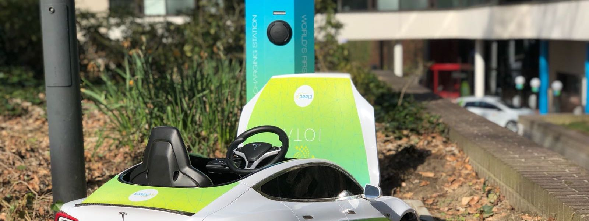

# IOTAChargeStation

The first IOTA charge station in the world!

## Overview

The IOTA charge station uses IOTA as a way of payment and data sharing between an EV (Electronic Vehicle) and a charge station. The charge station is able to work directly in an M2M fashion if the connected car supports this. Currently, cars do not support this out of the box, but charging an unmofidied car by paying IOTA from your wallet to the charge station is also possible.

## Hardware

The IOTA charge station is custom built and so is the Mini Tesla that we used for the demo in [this video](https://youtu.be/ymbbM3WfPQc). 

### Charge Station
- Mennekes Connector
- INSYS Powerline GP Modem
- Raspberry Pi
- Smart EVSE
- Power Meter
- Relay
- General charge point stuff

### Car (Modified Mini Tesla in our case)
- Car charge connector
- INSYS Powerline GP
- Raspberry Pi
- Mini Tesla Charger
- Custom circuit

## Software

The software in this repository is what we use to run the charge station and the modified car. Keep in mind that this charge station is a proof-of-concept and a lot of improvements can still be made. Also working with these specialized INSYS Powerline GP modems was a challenge and required some commandline magic :-).

Feel free to download the code, play with it, improve it or just use it. We chose to use the Apache license for this code since we want to keep it open source including all the future improvements or products derived from this charge station!

